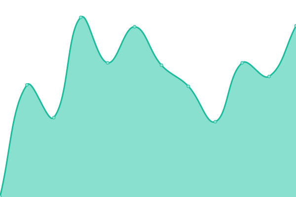
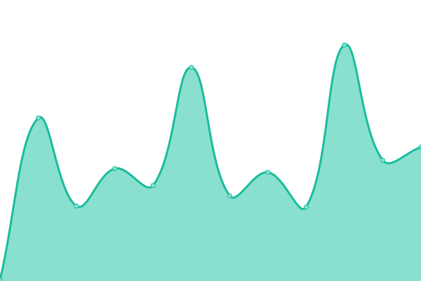
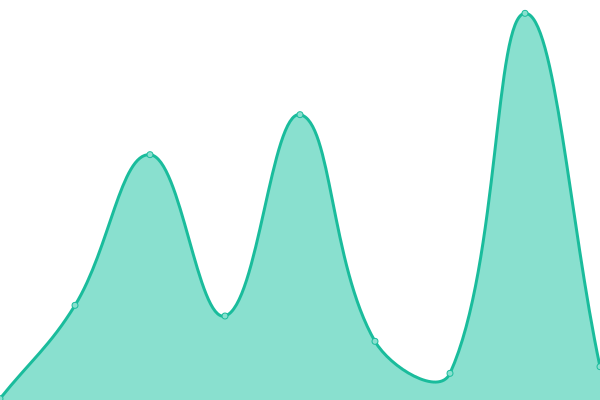

# [📈 Live Status](https://yunfankang.github.io/upptime): <!--live status--> **🟧 Partial outage**

This repository contains the open-source uptime monitor and status page for [Yunfan Kang](https://yunfankang.github.io/upptime), powered by [Upptime](https://github.com/upptime/upptime).

With [Upptime](https://upptime.js.org), you can get your own unlimited and free uptime monitor and status page, powered entirely by a GitHub repository. We use [Issues](https://github.com/yunfankang/upptime/issues) as incident reports, [Actions](https://github.com/yunfankang/upptime/actions) as uptime monitors, and [Pages](https://yunfankang.github.io/upptime) for the status page.

<!--start: status pages-->
<!-- This summary is generated by Upptime (https://github.com/upptime/upptime) -->
<!-- Do not edit this manually, your changes will be overwritten -->
<!-- prettier-ignore -->
| URL | Status | History | Response Time | Uptime |
| --- | ------ | ------- | ------------- | ------ |
|  [I-GUIDE](https://iguide.illinois.edu) | 🟩 Up | [i-guide.yml](https://github.com/YunfanKang/upptime/commits/HEAD/history/i-guide.yml) | 

 641ms
     
 | 

<a href="https://yunfankang.github.io/upptime/history/i-guide">100.00%</a>
    

|  [I-GUIDE Datacatalog](https://iguide.cuahsi.io) | 🟩 Up | [i-guide-datacatalog.yml](https://github.com/YunfanKang/upptime/commits/HEAD/history/i-guide-datacatalog.yml) | 

 119ms
     
 | 

<a href="https://yunfankang.github.io/upptime/history/i-guide-datacatalog">100.00%</a>
    

|  [Upptime test page deleted (404)](https://yunfankang.github.io/uptime-test-for-iguide) | 🟩 Up | [upptime-test-page-deleted-404.yml](https://github.com/YunfanKang/upptime/commits/HEAD/history/upptime-test-page-deleted-404.yml) | 

 71ms
     
 | 

<a href="https://yunfankang.github.io/upptime/history/upptime-test-page-deleted-404">100.00%</a>
    

|  [Random url (Can't be reached)](http://dfdsfsafs.com) | 🟥 Down | [random-url-can-t-be-reached.yml](https://github.com/YunfanKang/upptime/commits/HEAD/history/random-url-can-t-be-reached.yml) | 

 0ms
     
 | 

<a href="https://yunfankang.github.io/upptime/history/random-url-can-t-be-reached">0.00%</a>
    

<!--end: status pages-->

[**Visit our status website →**](https://yunfankang.github.io/upptime)

## 📄 License

- Powered by: [Upptime](https://github.com/upptime/upptime)
- Code: [MIT](./LICENSE) © [Anand Chowdhary](https://anandchowdhary.com), supported by [Pabio](https://pabio.com)
- Data in the `./history` directory: [Open Database License](https://opendatacommons.org/licenses/odbl/1-0/)
